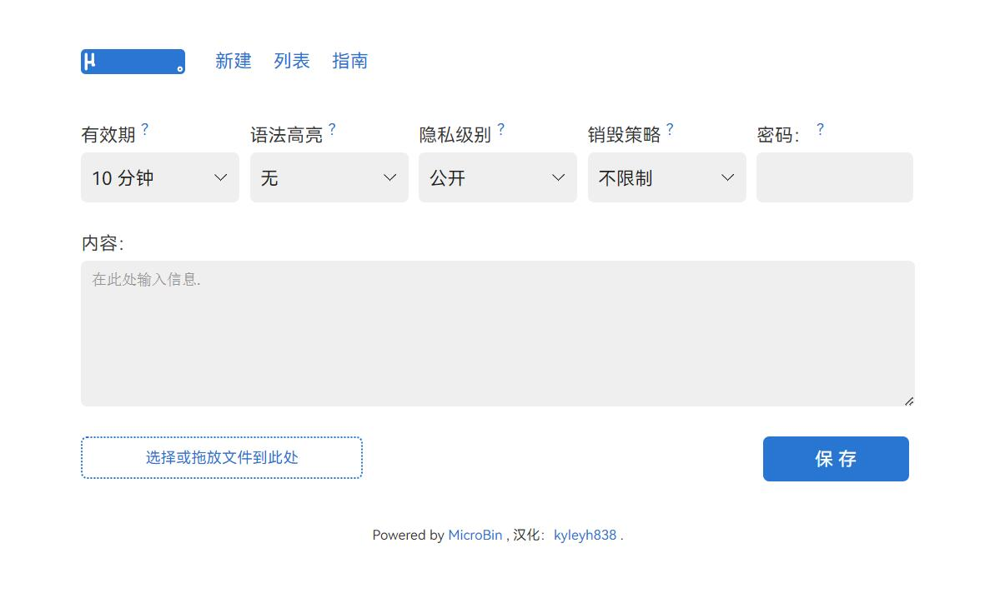

### 汉化演示：




MicroBin is a super tiny, feature rich, configurable, self-contained and self-hosted paste bin web application. It is very easy to set up and use, and will only require a few megabytes of memory and disk storage. It takes only a couple minutes to set it up, why not give it a try now?

### Check out the Public Test Server at [pub.microbin.eu](https://pub.microbin.eu)!

### Or host MicroBin yourself

Run our quick docker setup script ([DockerHub](https://hub.docker.com/r/danielszabo99/microbin)):

```bash
bash <(curl -s https://microbin.eu/docker.sh)
```

***

汉化版Docker安装脚本：

```bash
bash <(curl -s https://raw.githubusercontent.com/kyleyh838/microbin-zh_Hans/master/docker-setup.sh)
```

> 演示站点:
> [https://mbdemo.reas.eu.org](https://mbdemo.reas.eu.org/)

***
